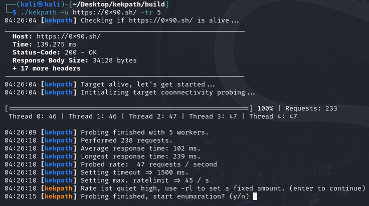

# KekPath

KekPath is a powerful and customizable recursive web scanner designed to crawl websites, capturing and analyzing links, resources, and endpoints. With features like threading control, rate limiting, User-Agent randomization, and more, KekPath is the perfect tool for security professionals, developers, and researchers.

## Features

- **Recursive Web Scanning**: Crawl websites recursively blazingly fast to capture and analyze all available links, resources, and endpoints.
- **Connectivity probing**: Probes the connectivity and calculates optimal request rate and timeout, also auto adjusts rate and timeout if connectivity issues detected. (Ex. when web server overwhelmed)
- **Customizable Threading**: Adjust the number of concurrent threads (1-200) to optimize scanning speed.
- **Rate Limiting**: Control the number of requests per second to avoid triggering anti-scraping mechanisms or overwhelming the target server.
- **User-Agent Randomization**: Randomize User-Agent strings to simulate requests from different browsers, enhancing stealth during scans.
- **Request Timeout Control**: Set custom timeout values to ensure smooth and responsive scanning.
- **Network Interface Selection**: Specify the network interface for the scanner to use, providing more control over network traffic.
- **File Extension Exclusion**: Exclude specific file types (e.g., `.php`, `.js`, `.png`) from the scan to focus on relevant content and reduce noise.
- **Output Control**: Save scan results to a custom file path or use the default naming convention with a timestamp.
- **Debug Mode**: Enable detailed debug output to monitor the scanning process in real-time.



[Usage Video](https://github.com/0x90sh/kekpath/raw/main/usage.mp4)

## Installation

### Prerequisites

- **CMake**: Ensure CMake is installed on your system. You can install it using your package manager or from the official [CMake website](https://cmake.org/download/).
- **libcurl**: KekPath requires `libcurl` for HTTP requests. Install it using your package manager:

  - **Debian/Ubuntu**: 
    ```bash
    sudo apt-get update
    sudo apt-get install libcurl4-openssl-dev
    ```
  
  - **CentOS/Fedora**:
    ```bash
    sudo yum install libcurl-devel
    ```

  - **macOS**:
    ```bash
    brew install curl
    ```

### Building KekPath

1. Clone the repository:
   ```bash
   git clone https://github.com/yourusername/kekpath.git
   cd kekpath
   ```

2. Create a build directory and navigate to it:
   ```bash
   mkdir build
   cd build
   ```

3. Run CMake to generate the build files:
   ```bash
   cmake ..
   ```

4. Compile the project:
   ```bash
   make
   ```

5. The binary will be generated in the `build` directory. You can run KekPath using:
   ```bash
   ./kekpath
   ```

## Usage

KekPath provides a range of options to customize your web scanning. Below are some of the key options:

```bash
./kekpath -u <URL> [OPTIONS]
```

### Options

- `-u <URL>` : Set the target URL (required)
- `-p <PORT>` : Set the port number (default: 80)
- `-excl <EXTS>` : Exclude certain file extensions (comma-separated, e.g., .php,.js)
- `-t <TIMEOUT>` : Set the request timeout in milliseconds (500-10000)
- `-ua <USER_AGENT>` : Set the User-Agent string (or use 'rand' for random)
- `-dbg` : Enable debug mode
- `-tr <THREADS>` : Set the number of threads (1-5)
- `-rl <RATE>` : Set the max request rate per second (1-50)
- `-n <INTERFACE>` : Specify the network interface to use
- `-o <OUTPUT>` : Specify the output file path (if not set, default naming is used)
- `-h, -help` : Show help message

### Example Usage

```bash
./kekpath -u https://example.com -excl .png,.jpg,.gif -t 3000 -tr 4 -rl 10
```

This command will scan `https://example.com` using 4 threads, excluding image files, with a 3000ms timeout and a rate limit of 10 requests per second.

## License

KekPath is released under the [GPL License](LICENSE).

## Contributing

Contributions are welcome! Please fork the repository and submit a pull request with your changes. Ensure your code follows the existing style and includes relevant tests.

## Contact

For any questions or suggestions, feel free to open an issue or contact me directly.
